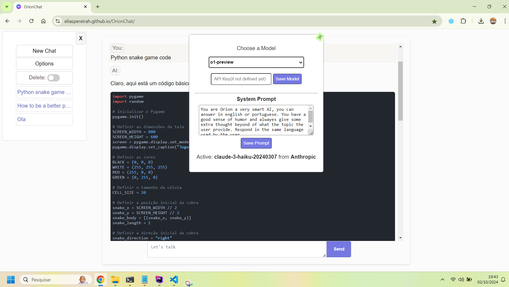

# OrionChat

OrionChat is a *free* web-based chat interface that simplifies interactions with multiple AI model providers.
It provides a unified platform for chatting and exploring multiple large language models (LLMs), including:

- 🛠️ Ollama – An open-source tool for running LLMs locally 🏡 
- 🤖 OpenAI
- 🌌 Google Gemini
- 🟡 Claude (Anthropic)
- 🚀 Groq Inc. – Optimized for fast inference ⚡️
- ⚡️ Cerebras – Also optimized for fast inference 🚀

It's like assembling the ultimate superhero team of AI

With OrionChat, users can easily navigate and assess the strengths and limitations of different AI models through an intuitive,
user-friendly interface.

## Key Features

- 🖥️ Browser - No need to download anything ⚡️
- 🗣️ TTS - Realistic text-to-speech using ElevenLabs 🎙️
- 🔄 Seamless integration with multiple AI models 🤖
- ✨ Clean and responsive web interface 🌐
- 🌈 Syntax highlighting for code snippets 🖌️
- ⬇️ One-click download for AI-generated code outputs ⚙️
- 🎛️ Customizable system prompts to tailor responses 🛠️

## API Key Management

Your API keys are stored locally using `localStorage`, and requests are sent directly to the official provider's API
(OpenAI, Anthropic, Google, Groq, Cerebras) without routing through any external proxy, ensuring security and privacy.

### Free API Keys

- **Google Gemini:** [Get your key](https://aistudio.google.com/app/apikey)
- **Cerebras:** [Sign up for an API key](https://cloud.cerebras.ai/platform/)
- **Groq:** [Request a key](https://console.groq.com/keys)

### Paid API Keys

- **OpenAI:** [Get your key](https://platform.openai.com/api-keys)
- **Anthropic:** [Sign up for an API key](https://console.anthropic.com/settings/keys)

## License

This project is open-source and available under the [MIT license](LICENSE).